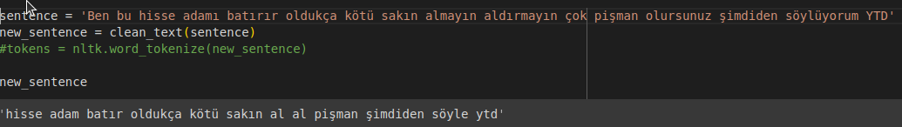
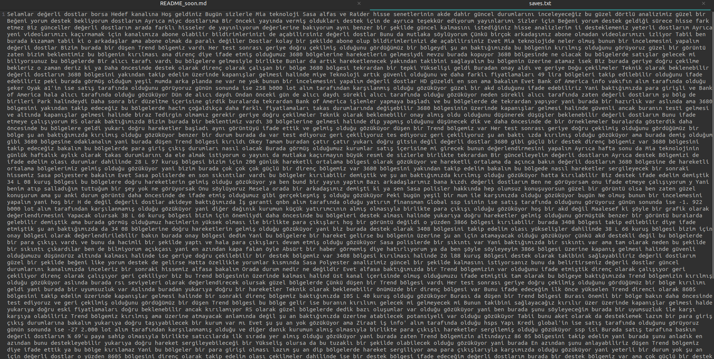

# Hisse senetlerinin ileri dönem hareketlerinin tahmini

Bu program içeriğindeki yardımcı kütüphaneler ve apiler sayesinde youtube'dan analiz videoları izleyerek yapılan yorumları değerlendirir ve aranan hisse hakkında yorumların ne olduğunu açıklar

## Kullanılan Kütüphaneler

- Pandas
- NumPy
- google
- googleapiclient
- Scikit-learn
- Nltk
- Pyplot


# VERİ SETİ'NİN OLUŞTURULMASI

Dataseti Kaggle ve elimle oluşturduğum verilerden oluşcaktır.Çıkarabilcek sonuçlar arasında hissenin gelecek dönemde olumlu, olumusuz veya belirsiz bir yol izleyeceği seçilcektir burda anahtar kelimeler ve verilerin temizliği uygunluğu model'in doğru çalışması için gereklidir.Bunun için ise aranan nitelikler şöyledir:

- Yorumlar argo içermemeli
- Kelimelerin doğru yazılması
- stop word'lerin olabildiğince az kullanılmış olması

Bu kriterleri sağlayan tüm veri setleri kaynak olarak kullanılabilir. 

Pythonda youtube ile istenilen verileri çekebilmek için farklı yetenekleri olan pyton kütüphanesi google ve googleapiclient kullanılıyor.
[apiler](https://github.com/googleapis/google-api-python-client)


Youtube apisinin bir videoyu çekebilmesi için transcipt'in oluşturulması (bu genelde her video için youtube tarafıdan otomatik olarak sağlanır) ikinci olarak ise videonun 3.taraf yazılımlar tarafından indirme izininin olması gerekir aksi halde video'ya indirmek isteği bir [permission denied](https://docs.github.com/en/authentication/troubleshooting-ssh/error-permission-denied-publickey)
istisnasına yol açar

### Örnek bir sorgu:
```
 def get_video_transcript(self,video_id):

        captions = self.youtube.captions().list(
            part='snippet',
            videoId=video_id
        ).execute()

        if 'items' in captions:
            # Videonun bir veya daha fazla altyazısı varsa
            caption_id = captions['items'][0]['id']

            # Altyazı metnini indir
            caption_text = self.youtube.captions().download(
                id=caption_id
            ).execute().decode('utf-8')

            self.transcript = caption_text

            return caption_text
        
        else:

            return None
```

Bu sorgu transcipt için istekte bulunur

Youtube api kuralları gereği her bir yeni istek bir doğrulama ekranına yönlendirilir bu nedenle program kapatılıp açılması bir son kullanıcıya ihtiyaç duyar


### Verilerin Çekilme Süreleri:

12 dk'lık bir videonun transcipt'inin inidirilme süresi 12 saniyedir.


### Oluşturulmuş Olan Veri seti'nin Görseli:


# Yorumların Temizlenmesi ve Lemmatization İşlemi
Veriseti oluşturulduktan sonra modelin daha iyi çalışması ve başarı oranının daha yüksek olması için yorumların temizlenmesi gerekmektedir. Yorumların içerisinde emojiler, noktalama işaretleri, stopwordsler, linkler gibi istenmeyen ve modelin başarısını düşürecek veriler yorumlar içerisinden temizleniyor. Daha sonra lemmatization (kelimelerin köklerinin alınması) işlemi yapılarak temiz ve kelimelerin köklerinden oluşan yorumlar elde ediliyor.

### Oluşturulan Temiz Yorum Görseli



# Modelin Oluşturulması ve Yorumların Kategorilendirilmesi

## Model Seçimi
Yapılacak kategorilendirme işleminin hangi modelde daha yüksek başarı oranı vereceğini tespit etmek amacıyla araştırma yapılıp aynı zamanda bazı modeller üzerinde de test edilmiştir. Başlangıç olarak 3 popüler model üzerinde denemeler yapılmıştır. Bu modeller Naive Bayes, DecitionTree ve SVM modelidir. Veriseti üzerinde bu modellerin accuracy ve f1 score ları test edilmiştir. Projedeki test veriseti sonuçlarına bakıldığında:

- Naive Bayes Modeli için  f1 score: 0.710 
- DecitionTree Modeli için f1 score: 0.818
- SVM için (linear) f1 score: 0.765
- SVM (rbf) için f1 score: 0.807


kullanılan dilin farklılığı ve teknik analiz kavramları doğruluk oranlarını oldukça düşürmektedir.


Sonuçlar incelendiğinde DecitionTree ve SVM (linear c=10) modelinin projede kullanılan verisetine göre vericeği sonuçların başarısı yeterlidir. Bu iki modelin kullanımına karar verilmiştir.

Support Vector Machine modeli kullanılmıştır. 

## Modelin Oluşturulmaya Başlanması

### Etiketleme
Yapılan yorumların bulunduğu "yorumlar.csv" dosyası dataframeye aktarılmıştır. Yorumların ifade ettiği değerlendirmeler -1 0 1 gibi bilgisayarın anlayabileceği bir formata dönüştürülmelidir. 'etiketli' adında yeni bir kolon açılarak olumsuz yorumlar için -1 sayısı, olumlu yorumlar için  1 sayısı, tarafsız yorumlar için 0 sayısı eklenmiştir.
 


### Verisetinin Parçalanması
Modelin başarısını doğru şekilde ölçebilmek için modeli eğittiğimiz veriler ile test ettiğimiz veriler farklı olmalıdır. Modelin eğitilmiş olduğu verileri tekrar modele gönderirsek model bu veriler ile eğitildiği için başarısı yüksek ve yanıltıcı olacaktır. Bu yüzden verisetini parçalamamız gerekir. Bu projede verisetinin %80 'i modeli eğitmek için, %20 'si de modeli test etmek için kullanılacaktır.

Verisetini parçalamak için train_test_split() fonksiyonu kullanılmıştır.

### Tweetlerin Vektörel Matrisinin Çıkarılması
Yorumlar metinden oluştuğu için bunun bilgisayar ortamında işlenmesi mümkün değildir bu yüzden veriler sayısal değerlere dönüştürülmelidir. Bir sözlük oluşturularak dökümandaki her kelime için bir indexleme yapılır. Daha sonra hangi index numarasına sahip kelimenin hangi yorumda kaç kere geçtiği hesaplanarak sayma matrisi oluşturulur. Bu işlemi yaparken tf-idf vectorizer kullanılarak bir kelimenin döküman içindeki önemi istatistiksel olarak hesaplanmıştır. Bu sayede her tweette geçen model için anlamsız kelimelerin önemi düşürülmüştür yani stopwordsler tekrardan ayıklanmıştır.

### Modellerin Eğitilmesi
Daha önceden parçalanmış olan X_train ve y_train verileri Naive Bayes ve Support Vector Machine modeline gönderilerek modeller eğitilmiştir. Eğitim sonucunda modellerin accuracy ve f1 score değerleri hesaplanmıştır. Modelleri eğitmek için sklearn kütüphanesi kullanılmıştır.

### Modellerin Başarısının Hesaplanması
Modelin başarısı hem train hem test verileri üzerinden Accuracy ve F1 score ile ölçülmüştür. Alınan sonuçlar aşağıda bulunmaktadır.

Naive Bayes                |  Support Vector Machine  
:-------------------------:|:-------------------------: 
||   |

### Modellerin Hata Oranları
- Modelin inceliklerini anlamaya çalıştığımızda yorumlar keskinleşince bayes yanlış sonuç veriyor.


Modellerin hata oranlarını tespit etmek için 2 farklı metrik kullanılmıştır. Bunlar Ortalama Kare Hatası(MSE) ve Ortalama Mutlak Hata(MAE) dir.

##### Ortalama Kare Hatası(MSE)
Ortalama Kare Hatası tahmin edilen sonuçlarınızın gerçek sayıdan ne kadar farklı olduğuna dair size mutlak bir sayı verir.

##### Ortalama Mutlak Hata(MAE)
Ortalama mutlak hata, mutlak hata değerinin toplamını alır, hata terimlerinin toplamının daha doğrudan bir temsilidir.


Sonuçlar incelendiğinde Support Vector Machine modelinin Naive Bayes modeline göre biraz daha az hata yaptığını görüyoruz.


### Manuel kontrol
Modeli manuel olarak test etmek için elle bazı yorumlar girilecek ve modelin bu yorumların hangi durumlara ait olduğunu tahmin etmesi istenecektir. Test sonuçları aşağıda gösterilmiştir.


##### Test1:


##### Test2:


##### Test3


##### Test4


##### Test5


# youtube apisinden çekilen metin
- Api ile çekilen metin ise şu şekilde temizlenip kayıt edilmelidir.Zira veri her biri zaman damgalı cümle topluluklarından oluşur.



## ham api metni:


# Sonuç
Sonuçlar kullanılan veri setiyle beraber çok dalgalanmıştır.Borsa yorumları çok fazla spesifik görüş içerir ve kelime dağarcığı borsada aktif olan her kesimden insanın düşüncelerini ve cümle yapılarını içerir dolayısıyla konu hakkında tahmin yapmak oldukça zorlaşır.Burda farklı kelimeleri içeren yorumları bulma konusunda oldukça zayıf kaldım.19.000'e yakın yorum kullansam bile doğruluk oranlarını %84'e zor çıkardım burda çeşitli algoritmalarla beraber optimizasyon seçeneklerini de yerine getirdim.Cümleleri köklerini bulma işlemine sokmak onların olumsuz olma kısımlarını oldukça sınırlıyo bu anlamda cümledeki 'iyi', 'kötü' , 'güvenilmez' ,'alınmaz' vsvs. keliemeler dil bilgisi kuralları kullanılmaksızın pekte anlamlı bir kullanım içermiyo.Burda kullanıcıların iyi yorumlarında iyi gibi kelimeleri daha çok kullandığını düşünmek gerekiyor.Bu tip modellerde SVM çok faydalı il yapıyor, bir yapay sinir ağında demeler gerçekleştirdin fakat onları burda paylaşmıyorum.Ama svm'nin kullandığım modeller arasında en iyi performans göstereni olduğunu söyleyebilirim.Youtube'un api erişiinde tokenizasyon kısıtlaması işleri zorlaştırıyor, günlük yenilendiğiiçin bazı günlerde denemeleri kesmek zorunda kaldım.Diğer bir problem youtube videolarının trankriptlerinin inidirilebilmesi için Videonun sahinini 3.taraf yazılımlara izin vermesi gerekiyor.Bu da projenin ancak anlaşmalı kanallarla birlikte işe yarayacağını gösteriyor.Son karşılaşılan problem video'da kişilerin bir kaç hisse hakkında karşılaştırmalı konuşması burda  konular bir birinden keskin bir sınırla ayrılmalı bahsedilen hisse senetlerinin akıbeti orataya çıksın.Ben modelimde hakkında konuşulan kısmın tamamını alıyorum belki yüzlerce kelime konuşuluyo burda yorum kısının daha kısaltılması sonucları etkiliycektir.
